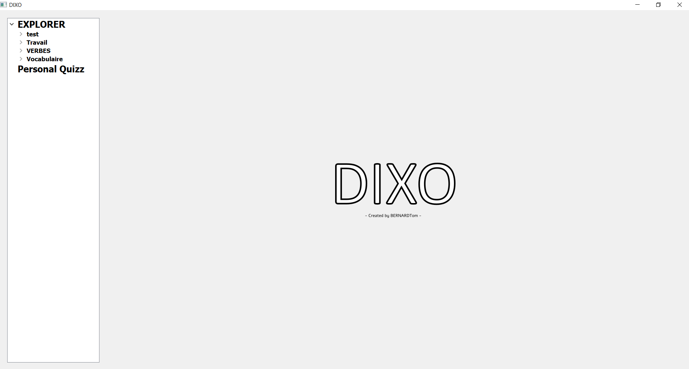
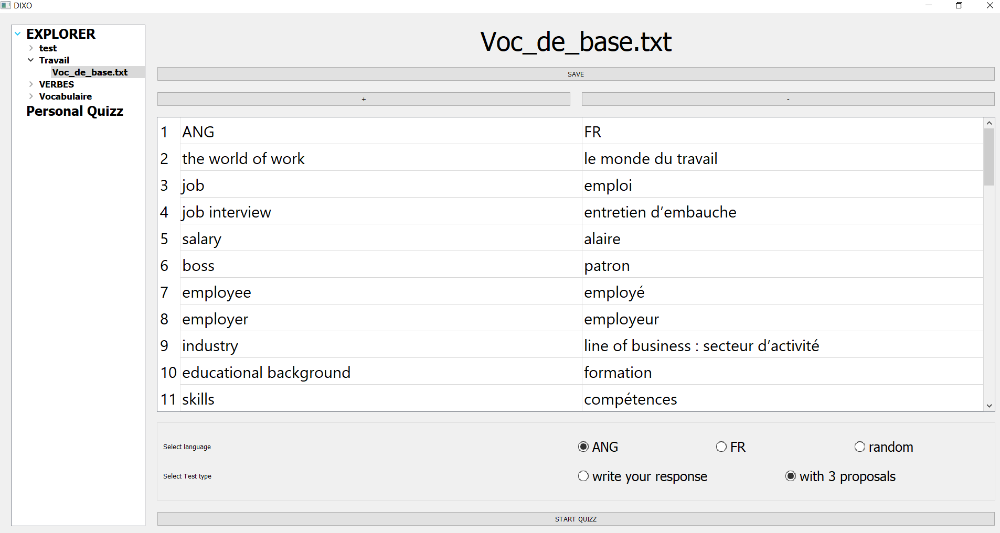
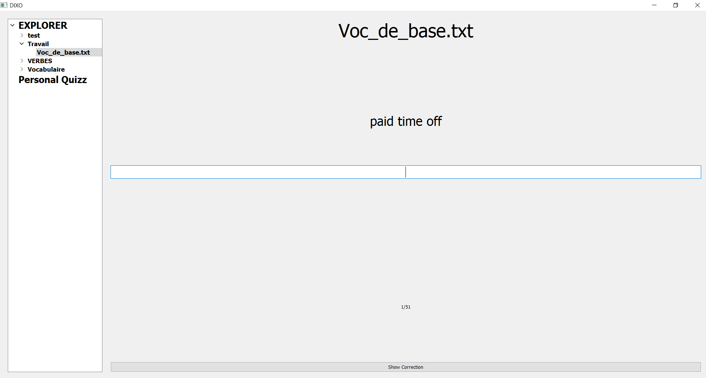
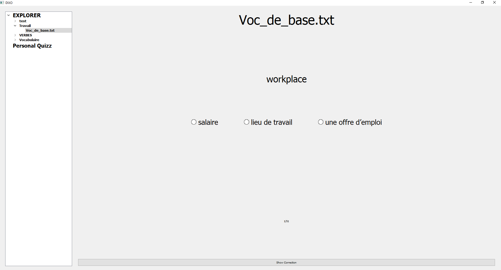

# DIXO
## Dictionnaire personnalisé pour la traduction

## Présentation
Le scripte présent dans le répertoire est un petit projet personnel permettant de créer des "tables" personnalisé de mots et de leurs traduction dans un language voulu. Différents paramètres permettent de lancer un Quizz afin d'améliorer la connaissance de son vocabulaire. 

